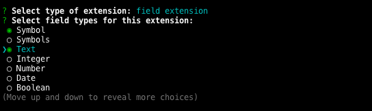

# Create Contentful Extension [](https://github.com/contentful/create-contentful-extension/pulls)

Create Contentful Extension is a CLI tool for developing in-app extensions without the hassle of managing build configurations.

If something doesn’t work, please [file an issue](https://github.com/contentful/create-contentful-extension/issues/new).

## Quick Overview

```sh
npx @contentful/create-contentful-extension my-first-extension
cd my-first-extension
npm run login && npm run start
```

### Requirements

- Node 8 or higher
- NPM 5.2 and higher

### Get Started Immediately

You **don’t** need to install or configure tools like Webpack or Babel.<br>
They are preconfigured and hidden so that you can focus on the code.

We use [Parcel](https://parceljs.org) bundler under the hood and you can use all assets that are supported there with no additional configuration.

## Creating an extension

```
npx @contentful/create-contentful-extension my-first-extension
```

It will ask you want type of extension you want to create ([read about different types of extensions](https://www.contentful.com/developers/docs/extensibility/ui-extensions/)):

<p align='center'>

</p>

Then `npm` will install all required development and production dependencies and create a directory called `my-first-extension` inside the current folder.

Inside that directory, it will generate the initial project structure:

```
my-first-extension
├── node_modules
├── .babelrc
├── package.json
├── extension.json
└── src
    ├── index.html
    ├── index.js
    └── index.css
```

Once the installation is done, you can open your project folder:

```sh
cd my-first-extension
```

Inside the newly created project, you can run some built-in commands:

### `npm run start`

Starts the development server and deploys the extension in development mode.

The extension will automatically reload if you make changes to the code.

**Note about https:** You can enable `https` by setting the `HTTPS` environment variable to `true`: 

```bash
HTTPS=true npm run start
```

Parcel uses a self-signed certificate to [enable https](https://parceljs.org/cli.html#enable-https). If the extension doesn't load or shows a security warning, open [https://localhost:1234](https://localhost:1234) in a new window and add an exception. When you go back to Contentful and reload the page, the security warning should be gone. On Firefox you might have to do the same for [https://localhost:54321](https://localhost:54321) (the websocket port) to get hot reloading to work.

### `npm run build`

Builds the extension for production to the `build` folder.<br>
It correctly bundles React and all dependencies in production mode and optimizes the build for the best performance.

### `npm run login`

Starts new session with our CLI. As the CLI tool uses our Content Management API, you need to have an CMA access token to use all the commands.

### `npm run logout`

Ends your current session with the CLI tool.

### `npm run deploy`

Bundles the extension for production and deploys bundled version to Contentful.

### `npm run help`

Shows help information about `create-contentful-extension`.

## What’s Included?

Your environment will have everything you need to build a modern Contentful UI Extension with React:

- React, JSX, ES6, TypeScript and all that supported by [Parcel](https://parceljs.org)
- [Forma 36](https://f36.contentful.com/) - React component library for Contentful design system.
- A live development server with hot reload.
- A build script to bundle JS, CSS, and images for production by inlining everything to `srcdoc`
- Hassle-free updates for the above tools with a single dependency.

Despite the fact that we encourage you to use React + Forma36 for building extensions, you can pick any framework and use it as you would use it with Parcel bundler.

## Contributing

We'd love to have your helping hand on `create-contentful-extension`!

## License

Create Contentful Extension is open source software [licensed as MIT](./LICENSE).
