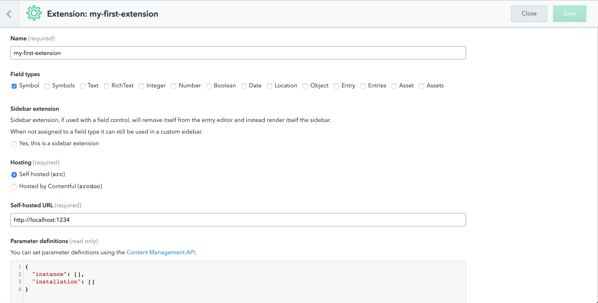

# Create Contentful Extension [](https://github.com/contentful/create-contentful-extension/pulls)

Create Contentful Extension is a CLI tool for developing in-app extensions without the hassle of managing build configurations.

If something doesn’t work, please [file an issue](https://github.com/contentful/create-contentful-extension/issues/new).

## Quick Overview

```sh
npx @contentful/create-contentful-extension my-first-extension
cd my-first-extension
npm install
npm run login && npm run configure
npm run start
```

### Requirements

- Node 8 or higher
- NPM 5.2 and higher

## What’s Included?

Your environment will have everything you need to build a modern Contentful UI Extension with React:

- React, JSX, ES6, TypeScript and all that supported by [Parcel](https://parceljs.org)
- [Forma 36](https://f36.contentful.com/) - React component library for Contentful design system.
- A live development server with hot reload.
- A build script to bundle JS, CSS, and images for production by inlining everything to `srcdoc`

Despite the fact that we encourage you to use React + Forma36 for building extensions, you can pick any framework and use it as you would use it with Parcel bundler.

### Get Started Immediately

You **don’t** need to install or configure tools like Webpack or Babel.<br>
They are preconfigured and hidden so that you can focus on the code.

We use [Parcel](https://parceljs.org) bundler under the hood and you can use all assets that are supported there with no additional configuration.

## Creating an extension

```
npx @contentful/create-contentful-extension my-first-extension
```

It will ask you what type of extension you want to create ([read about different types of extensions](https://www.contentful.com/developers/docs/extensibility/ui-extensions/)):

<p align='center'>

</p>

Then `npm` will install all required development and production dependencies and create a directory called `my-first-extension` inside the current folder.

Inside that directory, it will generate the initial project structure:

```
my-first-extension
├── node_modules
├── .babelrc
├── .contentfulrc.json
├── .gitignore
├── package.json
├── extension.json
└── src
    ├── index.html
    ├── index.js
    └── index.css
```

Once the installation is done, you can open your project folder:

```sh
cd my-first-extension
# install dependencies
npm install
# login to contentful
npm run login
# select what space and enviroment you'll be using for development and deployment
npm run configure
# starts development server and publishes the extension in a development mode
npm run start
```

When the development server is up and running open [https://app.contentful.com](https://app.contentful.com).

Go to `Settings` -> `Extensions` to verify that extension is installed in a development mode.

<p>

</p>

<p>

</p>

Go to `Content model` configuration.

<p>

</p>

Select a field in the Content Type. Navigate to `Settings` > `Appearance` of the field. Assign the extension to a field.

<p>

</p>

Go to the content of this Content Type and enable [mixed content](https://developers.google.com/web/fundamentals/security/prevent-mixed-content/fixing-mixed-content) at your browser so that development version that is served from your local machine could be rendered within `https://app.contentful.com`.

<p>

</p>

<p>

</p>

## Commands

### `npm run start`

Starts the development server and deploys the extension in development mode.

The extension will automatically reload if you make changes to the code.

### `npm run build`

Builds the extension for production to the `build` folder.<br>
It correctly bundles React and all dependencies in production mode and optimizes the build for the best performance.

### `npm run login`

Starts new session with our CLI. As the CLI tool uses our Content Management API, you need to have an CMA access token to use all the commands.

### `npm run logout`

Ends your current session with the CLI tool.

### `npm run configure`

Asks which space and environment you want to use for development and deployment. It saves your answers to local `.contentfulrc.json`.

**Caution**: Do not commit `.contentfulrc.json` to your repository. It contains sensitive information and intended to be used only on your local machine.

### `npm run deploy`

Bundles the extension for production and deploys bundled version to Contentful.

### `npm run help`

Shows help information about `create-contentful-extension`.

## FAQ

### I want to use `test` environment for during the development. How can I set it up?

Use `npm run configure` command. It asks what space and environment you'd like to use. The answers are saved in `.contentfulrc.json` file, located next to `package.json`.

**Caution**: Do not commit `.contentfulrc.json` to your repository. It contains sensitive information and intended to be used only on your local machine.

### I want to serve extension in development mode from custom port number (not default 1234). Is it possible?

Yes, it's possible. Edit `start` scripts in package.json file according to the following example:

```json
"start": "contentful-extension-scripts start --port 8000",
```

### I use development mode but my extension is not showing up. What's wrong?

In development mode, extension is served from `http://localhost:1234`, but `app.contentful.com` is loaded via `https` protocol which leads the browser to prevent [mixed content](https://developers.google.com/web/fundamentals/security/prevent-mixed-content/fixing-mixed-content). While doing development you need to click **Load unsafe scripts** (Chrome) to enable serving extension from `http://localhost`.

### I'm not the biggest fan of disabling the mixed content setting in browsers. Can I use HTTPS in development mode?

Yes, you can serve your extension using HTTPS. Add `--https` to `start` command.

```
"start": "contentful-extension-scripts start --https",
```

It uses [Parcel HTTPS](https://parceljs.org/cli.html#enable-https) under the hood , which generates a self-signed certificate, you might have to configure your browser to allow self-signed certificates for localhost.

### I generated my extension with `create-contentful-extension` several months ago but I'd like to use features that became available later. How can I upgrade?

Just update `@contentful/contentful-extension-scripts` dependency in your `package.json` to the latest one and check [Releases](https://github.com/contentful/create-contentful-extension/releases) to see if there were any breaking changes. Follow the instructions there.

### My extension is bigger than 512Kb. How can I deploy it for production usage?

You can't use _Hosted by Contentful (`srcdoc`)_ hosted extension if the extension is bigger than 512Kb. But you can serve extension from any server using `src` property.

Instead of using `npm run deploy`, add `--no-inline` to build command:

```
"build": "contentful-extension-scripts build --no-inline"
```

It generates minified and production-ready version of your extension. Upload `build` folder to GitHub pages, Netlify or any other hosting and use _Self-hosted (`src`)_ option to serve the extension from your own domain.

## Contributing

We'd love to have your helping hand on `create-contentful-extension`!

## License

Create Contentful Extension is open source software [licensed as MIT](./LICENSE).
